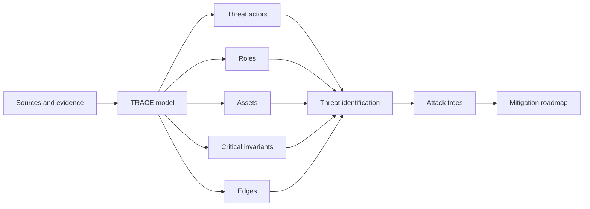
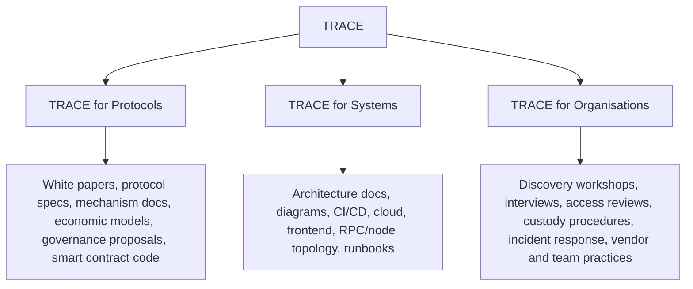
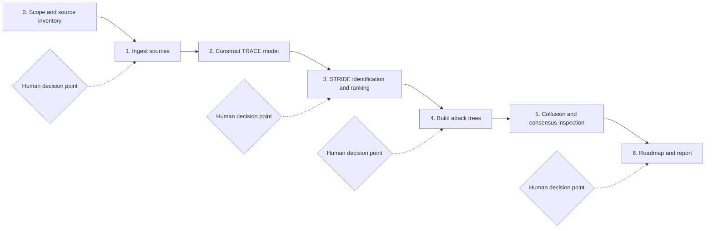

# TRACE Methodology Specification

TRACE is a threat modelling methodology for Web3 systems. It is designed to turn heterogeneous source material into a structured model of assets, roles, invariants, trust boundaries, value flows, and failure paths.

TRACE can be applied to protocols, technical systems, and organisations. The method is intentionally evidence-driven: every material threat should be traceable back to a source, model object, assumption, boundary, or attack path.

## Scope

TRACE is used to answer four practical questions:

- What must the system protect?
- Who or what can affect those protected properties?
- Where does value, control, data, or authority cross a boundary?
- Which failure paths are plausible enough to change design, architecture, operations, governance, or launch decisions?

TRACE is not a replacement for implementation audits. It is most useful before audits, alongside architecture reviews, during launch readiness work, and in operational security assessments.

## Core Model

TRACE stands for:

| Object | Definition | Typical Examples |
|---|---|---|
| Threat actors | Actors with capability, incentive, or authority to affect the system | External attackers, insiders, validators, delegates, vendors, governance participants, compromised users |
| Roles | Privileged or operational positions inside the system | Founders, signers, maintainers, deployers, administrators, operators, responders, keepers |
| Assets | Value or control that must be protected | Funds, keys, protocol control, governance power, uptime, private data, frontend integrity, validator rewards |
| Critical invariants | Properties that must remain true | Solvency, collateralization, accounting consistency, bounded governance power, slashing correctness, oracle integrity |
| Edges | Places where trust, value, data, or control crosses domains | Trust boundaries, value flows, signer paths, API boundaries, admin paths, CI/CD to deployment, governance to execution |

## The Three Pillars

TRACE has three application pillars. The same core method is used in each pillar, but the input material and model emphasis change.

### TRACE for Protocols

TRACE for Protocols is used at the design stage.

Inputs:

- White papers
- Protocol specifications
- Mechanism descriptions
- Economic models
- Governance proposals
- Prior audit notes
- Smart contract code, when available

Primary model focus:

- Protected assets
- Economic and protocol invariants
- Governance and upgrade authority
- Privileged protocol roles
- Value flows
- Oracle, bridge, sequencer, validator, relayer, or keeper assumptions
- Collusion and consensus assumptions

Typical outputs:

- Design-level threat model
- Protocol invariant map
- Governance and privileged-role risk analysis
- STRIDE threat catalogue by component or flow
- Attack trees for prominent threats
- Collusion or consensus-surface analysis where relevant
- Design and audit-readiness recommendations

### TRACE for Systems

TRACE for Systems is used at the architecture and infrastructure stage.

Inputs:

- System diagrams
- Architecture documents
- Deployment descriptions
- Cloud account and IAM structure
- CI/CD flows
- Infrastructure-as-code
- Package registry and dependency information
- Frontend deployment paths
- DNS, CDN, RPC, node, relayer, keeper, and validator topology
- Monitoring, logging, alerting, and incident runbooks

Primary model focus:

- Trust boundaries between on-chain and off-chain systems
- Build, deploy, and release authority
- Infrastructure control planes
- Signer and deployment-key paths
- Frontend integrity
- Node, validator, RPC, relayer, and keeper operations
- Dependency and supply-chain exposure

TRACE for Systems also works naturally with zero trust architecture. Each TRACE edge can be treated as a zero trust question:

- Who or what is crossing this boundary?
- What identity is being asserted?
- What device, workload, or service is making the request?
- What resource is being accessed?
- What action is being requested?
- What context changes the risk?
- What happens if the source is already compromised?

Typical outputs:

- Architecture-level threat model
- Trust boundary inventory
- Zero trust gap map for critical access paths
- CI/CD and supply-chain risk map
- Infrastructure and deployment attack trees
- Architecture and hardening recommendations

### TRACE for Organisations

TRACE for Organisations is used in operational security assessments.

Inputs:

- Discovery workshop findings
- Individual interviews
- Access reviews
- Device and account inventories
- Wallet, custody, multisig, MPC, and signer procedures
- Incident response plans
- Vendor and contractor relationships
- Travel and physical security assumptions
- Support, communications, and escalation workflows
- Observed team practices

Primary model focus:

- Human authority over assets and invariants
- Privileged people, groups, and vendors
- Account recovery and access restoration paths
- Signer ceremonies and approval workflows
- Incident coordination and decision-making
- Social, procedural, and organisational failure modes

Typical outputs:

- Operational threat model
- Human and process risk register
- Custody and signer risk analysis
- Incident readiness assessment
- Vendor and access-risk map
- 30/60/90-day operational hardening roadmap

## Standard Workflow

TRACE is deliberately sequential. Each phase produces a reviewable artifact that becomes input to the next phase.

### 0. Scope and Source Inventory

Define the assessment boundary and collect available evidence.

Required decisions:

- Which protocol, system, organisation, or lifecycle stage is being modelled?
- Which repositories, documents, diagrams, interviews, and operational records are in scope?
- Which known assumptions or exclusions must be recorded?
- Which missing sources create uncertainty?

Approval gate:

- A senior reviewer approves the source inventory, scope, and known gaps before model construction begins.

### 1. Ingest Sources

Extract candidate components, actors, roles, assets, invariants, dependencies, boundaries, and flows from the available material.

Source types may include:

- Protocol specifications
- White papers
- Smart contract code
- Architecture diagrams
- Cloud and deployment descriptions
- CI/CD configuration
- Operational procedures
- Discovery workshop notes
- Interview notes
- Existing audit or assessment reports

### 2. Construct the TRACE Model

Build the structured model:

- Threat actors
- Roles
- Assets
- Critical invariants
- Edges

The model should record evidence and assumptions. If a model object cannot be tied to a source, it should be marked as an inferred assumption.

Approval gate:

- A senior reviewer approves and complements the model before threat expansion.

### 3. STRIDE Threat Identification and Ranking

Apply STRIDE across relevant components, flows, roles, and boundaries.

STRIDE categories:

- Spoofing
- Tampering
- Repudiation
- Information disclosure
- Denial of service
- Elevation of privilege

Ranking should account for:

- Impact on assets and invariants
- Feasibility
- Profitability or incentive compatibility
- Existing mitigations
- Operational reality
- Blast radius
- Time sensitivity
- Confidence in the model

Approval gate:

- A senior reviewer checks the threat set and ranking before attack-tree work begins.

### 4. Build Attack Trees

Build attack trees for the most important threats. Each tree should start with an attacker goal and decompose the plausible conditions, branches, and steps that could make the goal achievable.

Attack trees should:

- Map back to STRIDE findings where possible
- Identify enabling assumptions
- Separate plausible branches from speculative branches
- Mark required roles, privileges, dependencies, or timing conditions
- Tie leaves to possible mitigations

### 5. Inspect Collusion and Consensus Surfaces

Run this phase when the system includes DAOs, multisigs, validators, sequencers, governance committees, oracle sets, relayer networks, committees, delegates, or other actor groups whose coordination can affect safety.

Inspect:

- Actor combinations
- Quorum assumptions
- Threshold assumptions
- Incentive alignment
- Governance capture paths
- Validator or operator coordination
- Accountable-fault assumptions
- Operational dependencies between supposedly independent parties

Approval gate:

- A senior reviewer validates which collusion paths are credible enough to include in the final model.

### 6. Produce Roadmap and Report

Translate the model into decisions.

Required outputs:

- Executive summary
- TRACE model
- Ranked threat list
- Attack trees for top threats
- Collusion and consensus findings, if applicable
- Mitigation roadmap
- Open assumptions and unresolved questions
- Recommended next steps for design, architecture, operations, audit readiness, or incident readiness

## Human-AI Co-Working Model

TRACE is designed for a human-AI co-working process with explicit decision points.

AI is useful for:

- Source extraction
- Candidate component identification
- Model consistency checks
- Coverage checks
- STRIDE prompt generation
- Attack-tree drafting
- Traceability support
- Report drafting

Senior reviewers are required for:

- Scope approval
- Economic invariant definition
- Threat classification and ranking
- Attack-tree plausibility checks
- Collusion and consensus judgement
- Severity calibration
- Recommendation sequencing
- Final report approval

The model should never be treated as complete merely because the source material was processed. Human review is a required part of the methodology.

## Output Quality Criteria

A TRACE output is acceptable when:

- Every material threat maps to at least one asset, invariant, role, or edge.
- Every major asset and invariant is covered by threat identification.
- Every critical edge is reviewed for trust, authority, and failure assumptions.
- Top-ranked threats have attack trees or a documented reason why an attack tree is not useful.
- Collusion and consensus assumptions are inspected where actor groups can coordinate.
- Recommendations are specific enough to change design, architecture, operations, or launch decisions.
- Open questions and missing evidence are clearly labelled.
- AI-generated candidates have been reviewed, corrected, and approved by senior reviewers.

## Relationship to Existing Methods

TRACE incorporates and adapts existing threat modelling practices:

- [STRIDE](https://learn.microsoft.com/en-us/azure/security/develop/threat-modeling-tool-threats) is used for structured threat identification.
- [Attack trees](https://www.schneier.com/academic/archives/1999/12/attack_trees.html) are used for depth on the most important threats.
- [PASTA](https://versprite.com/security-resources/risk-based-threat-modeling/) and [OWASP threat modelling guidance](https://owasp.org/www-project-threat-model/) inform the broader risk-analysis flow.
- [Zero trust architecture](https://csrc.nist.gov/pubs/sp/800/207/final) informs system and operational access-boundary analysis.
- [Byzantine consensus](https://www.microsoft.com/en-us/research/publication/byzantine-generals-problem/) and [accountable Byzantine consensus](https://www.sciencedirect.com/science/article/pii/S0743731523001132) work inform collusion and consensus-surface inspection.

TRACE is Web3-specific because it treats economic invariants, governance power, signer authority, off-chain infrastructure, human operations, and collusion surfaces as first-class modelling objects.

## Licensing

This methodology specification is licensed under CC BY 4.0 as part of the TRACE repository materials. See `LICENSE.md` and `TRADEMARKS.md`.
