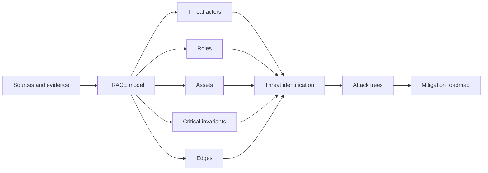
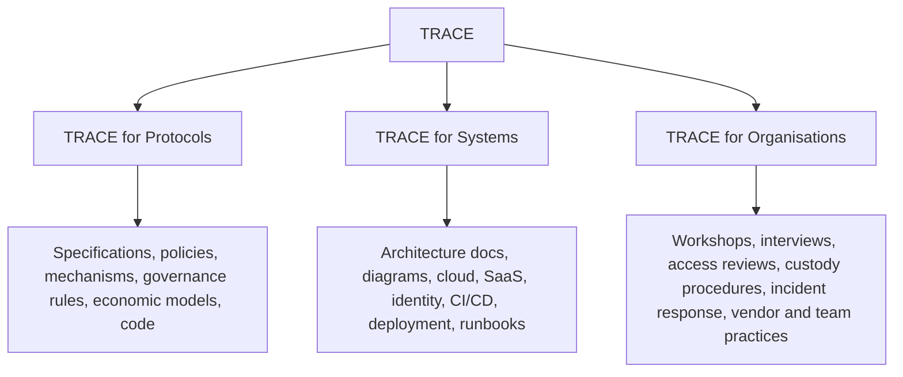

# TRACE Methodology Specification

Invented, designed, and authored by [Dr. Stefan Beyer](https://www.linkedin.com/in/st-beyer/) at Oak Security.

TRACE is a threat modelling methodology for modern organisations with heterogeneous, decentralized, cloud-first and remote-first operating environments. It is designed for environments where traditional perimeter security models do not describe reality well, and where a zero trust approach is needed across protocols, systems, and organisations.

TRACE turns heterogeneous source material into a structured model of assets, roles, invariants, trust boundaries, value flows, authority paths, and failure paths. The method is evidence-driven: every material threat should be traceable back to a source, model object, assumption, boundary, or attack path.

TRACE was developed through Web3 security work, where high-value assets, distributed authority, governance, infrastructure, and human operations are tightly connected. The method is more general than Web3. It is suitable for organisations with fragmented control paths, remote teams, cloud and SaaS dependency chains, critical human approvals, externally operated systems, and no clear security perimeter.

## Primary Drivers

TRACE is built around three practical realities:

- **No traditional security perimeter.** Modern organisations run across cloud services, SaaS platforms, identity providers, personal devices, contractors, vendors, automation, and public networks.
- **Three-layer threat modelling.** Meaningful risk often crosses protocols, systems, and organisations, so all three layers must be modelled together.
- **AI-human co-working.** AI can accelerate extraction, coverage, and draft analysis, but expert human judgement is required for assumptions, ranking, plausibility, collusion analysis, and recommendations.

## Scope

TRACE is used to answer four practical questions:

- What must the organisation, system, or protocol protect?
- Who or what can affect those protected properties?
- Where does value, control, data, or authority cross a boundary?
- Which failure paths are plausible enough to change design, architecture, operations, governance, or launch decisions?

TRACE is not a replacement for implementation audits, compliance assessments, or zero trust architecture work. It is a modelling layer that makes those activities more precise by showing which assets, invariants, roles, edges, and attack paths matter most.

## Core Model

TRACE stands for:

| Object | Definition | Typical Examples |
|---|---|---|
| Threat actors | Actors with capability, incentive, or authority to affect the target | External attackers, insiders, vendors, contractors, service providers, administrators, delegates, compromised users |
| Roles | Privileged or operational positions inside the target | Founders, executives, signers, maintainers, deployers, administrators, operators, responders, service owners |
| Assets | Value, control, data, authority, or continuity that must be protected | Funds, keys, credentials, production control, customer data, uptime, brand trust, source code, governance power |
| Critical invariants | Properties that must remain true | Segregation of duties, approval integrity, data integrity, financial correctness, bounded authority, deployment integrity, recovery ability |
| Edges | Places where trust, value, data, or control crosses domains | Trust boundaries, value flows, signer paths, API boundaries, admin paths, CI/CD to deployment, identity provider to cloud |

## The Three Pillars

TRACE has three application pillars. The same core method is used in each pillar, but the input material and model emphasis change.

### TRACE for Protocols

TRACE for Protocols is used at the design stage. A protocol is any formal or semi-formal rule system that governs value, authority, access, coordination, or critical behaviour. In Web3 this may be a blockchain protocol, smart contract system, validator network, or governance process. In a broader organisation it may be an approval protocol, access protocol, operational workflow, AI-agent control policy, financial process, data-sharing agreement, or safety-critical business process.

Inputs:

- White papers
- Protocol specifications
- Mechanism descriptions
- Policy and process specifications
- Economic or business models
- Governance proposals
- Product and architecture specifications
- Prior audit or assessment notes
- Source code or configuration, when available

Primary model focus:

- Protected assets
- Business, economic, technical, and operational invariants
- Governance and approval authority
- Privileged protocol roles
- Value and authority flows
- External dependencies
- Collusion, quorum, delegation, and consensus assumptions

Typical outputs:

- Design-level threat model
- Invariant map
- Governance and privileged-role risk analysis
- STRIDE threat catalogue by component or flow
- Attack trees for prominent threats
- Collusion or consensus-surface analysis where relevant
- Design and assessment-readiness recommendations

### TRACE for Systems

TRACE for Systems is used at the architecture and infrastructure stage.

Inputs:

- System diagrams
- Architecture documents
- Deployment descriptions
- Cloud account and IAM structure
- Identity provider and SaaS configuration
- CI/CD flows
- Infrastructure-as-code
- Package registry and dependency information
- Frontend, API, and service deployment paths
- Network, node, automation, and monitoring topology
- Logging, alerting, and incident runbooks

Primary model focus:

- Trust boundaries between internal, cloud, SaaS, vendor, and public systems
- Build, deploy, and release authority
- Infrastructure control planes
- Privileged credential and key paths
- Frontend, API, and data integrity
- Operational automation
- Dependency and supply-chain exposure

TRACE for Systems works naturally with [zero trust architecture](https://csrc.nist.gov/pubs/sp/800/207/final). Each TRACE edge can be treated as a zero trust question:

- Who or what is crossing this boundary?
- What identity is being asserted?
- What device, workload, or service is making the request?
- What resource is being accessed?
- What action is being requested?
- What context changes the risk?
- What happens if the source is already compromised?

Typical outputs:

- Architecture-level threat model
- Trust boundary inventory
- Zero trust gap map for critical access paths
- CI/CD and supply-chain risk map
- Infrastructure and deployment attack trees
- Architecture and hardening recommendations

### TRACE for Organisations

TRACE for Organisations is used in operational security assessments.

Inputs:

- Discovery workshop findings
- Individual interviews
- Access reviews
- Device and account inventories
- Wallet, custody, signing, approval, and privileged-action procedures
- Incident response plans
- Vendor and contractor relationships
- Travel and physical security assumptions
- Support, communications, and escalation workflows
- Observed team practices

Primary model focus:

- Human authority over assets and invariants
- Privileged people, groups, and vendors
- Account recovery and access restoration paths
- Approval workflows and exception paths
- Incident coordination and decision-making
- Social, procedural, and organisational failure modes

Typical outputs:

- Operational threat model
- Human and process risk register
- Custody, approval, and privileged-action risk analysis
- Incident readiness assessment
- Vendor and access-risk map
- 30/60/90-day operational hardening roadmap

## Standard Workflow

TRACE is deliberately sequential. Each phase produces a reviewable artifact that becomes input to the next phase.

### 0. Scope and Source Inventory

Define the assessment boundary and collect available evidence.

Required decisions:

- Which protocol, system, organisation, or lifecycle stage is being modelled?
- Which repositories, documents, diagrams, interviews, and operational records are in scope?
- Which known assumptions or exclusions must be recorded?
- Which missing sources create uncertainty?

Approval gate:

- A senior reviewer approves the source inventory, scope, and known gaps before model construction begins.

### 1. Ingest Sources

Extract candidate components, actors, roles, assets, invariants, dependencies, boundaries, and flows from the available material.

Source types may include:

- Protocol, policy, or process specifications
- White papers
- Source code and configuration
- Architecture diagrams
- Cloud, SaaS, and deployment descriptions
- CI/CD configuration
- Operational procedures
- Discovery workshop notes
- Interview notes
- Existing audit or assessment reports

### 2. Construct the TRACE Model

Build the structured model:

- Threat actors
- Roles
- Assets
- Critical invariants
- Edges

The model should record evidence and assumptions. If a model object cannot be tied to a source, it should be marked as an inferred assumption.

Approval gate:

- A senior reviewer approves and complements the model before threat expansion.

### 3. STRIDE Threat Identification and Ranking

Apply STRIDE across relevant components, flows, roles, and boundaries.

STRIDE categories:

- Spoofing
- Tampering
- Repudiation
- Information disclosure
- Denial of service
- Elevation of privilege

Ranking should account for:

- Impact on assets and invariants
- Feasibility
- Profitability or incentive compatibility
- Existing mitigations
- Operational reality
- Blast radius
- Time sensitivity
- Confidence in the model

Approval gate:

- A senior reviewer checks the threat set and ranking before attack-tree work begins.

### 4. Build Attack Trees

Build attack trees for the most important threats. Each tree should start with an attacker goal and decompose the plausible conditions, branches, and steps that could make the goal achievable.

Attack trees should:

- Map back to STRIDE findings where possible
- Identify enabling assumptions
- Separate plausible branches from speculative branches
- Mark required roles, privileges, dependencies, or timing conditions
- Tie leaves to possible mitigations

### 5. Inspect Collusion and Coordination Surfaces

Run this phase when the target includes actor groups whose coordination can affect safety. This may include governance bodies, executive teams, committees, vendors, contractors, administrators, validators, multisigs, external operators, support teams, or service providers.

Inspect:

- Actor combinations
- Quorum or threshold assumptions
- Incentive alignment
- Governance capture paths
- Vendor or operator coordination
- Accountable-fault assumptions
- Operational dependencies between supposedly independent parties

Approval gate:

- A senior reviewer validates which coordination or collusion paths are credible enough to include in the final model.

### 6. Produce Roadmap and Report

Translate the model into decisions.

Required outputs:

- Executive summary
- TRACE model
- Ranked threat list
- Attack trees for top threats
- Collusion and coordination findings, if applicable
- Mitigation roadmap
- Open assumptions and unresolved questions
- Recommended next steps for design, architecture, operations, assessment readiness, audit readiness, or incident readiness

## AI Usage and Human Co-Working

TRACE is designed to make AI and human co-working practical, reviewable, and safe. The methodology is deliberately sequential: each phase produces an artifact that can be inspected before the next phase begins. This prevents weak assumptions from being amplified into threat rankings, attack trees, or recommendations.

AI is used as an analysis accelerator, not as an autonomous threat modeller. It is useful for reading large source sets, extracting candidate model objects, checking coverage, proposing STRIDE candidates, drafting attack-tree branches, and maintaining traceability between evidence, model objects, threats, and recommendations.

Senior security reviewers remain responsible for judgement. They approve scope, correct the model, define critical invariants, rank threats, decide which attack paths are plausible, evaluate coordination assumptions, calibrate severity, and approve the final recommendations.

### AI-Assisted Tasks by Phase

| Phase | AI Can Help With | Human Review Required |
|---|---|---|
| Scope and source inventory | Summarize available material, identify missing documents, cluster sources by topic | Approve scope, exclusions, and source sufficiency |
| Source ingestion | Extract candidate components, roles, assets, flows, assumptions, and dependencies | Confirm that extracted items are accurate and relevant |
| TRACE model construction | Propose model structure, identify inconsistent terminology, link model objects to source evidence | Approve and complement threat actors, roles, assets, invariants, and edges |
| STRIDE identification | Generate candidate STRIDE threats per component, flow, role, or boundary | Remove weak threats, add missed threats, rank materiality |
| Attack trees | Draft branches and enabling conditions for top threats | Validate plausibility, feasibility, prerequisites, and missing branches |
| Collusion and coordination inspection | Enumerate actor combinations and dependency patterns | Judge incentives, real-world relationships, governance dynamics, and credible coordination paths |
| Roadmap and report | Draft summaries, tables, traceability matrices, and mitigation language | Calibrate severity, sequence recommendations, approve final report |

### Approval Gates

TRACE uses explicit approval gates:

- The source inventory is approved before modelling begins.
- The TRACE model is approved before STRIDE expansion.
- The ranked threat list is approved before attack-tree drafting.
- Attack trees are approved before recommendations are finalized.
- Collusion, coordination, and consensus assumptions are approved by a senior reviewer where relevant.
- Final recommendations are approved for severity, feasibility, sequencing, and usefulness.

### Evidence and Traceability Requirements

AI-generated outputs should be treated as candidate analysis until they are checked. Each material item should be traceable:

- Model objects should link back to sources or be marked as inferred assumptions.
- STRIDE threats should link to components, flows, roles, or edges.
- Attack-tree roots should link to ranked threats.
- Attack-tree leaves should link to enabling assumptions or concrete system facts.
- Recommendations should link to threats, attack-tree leaves, assets, invariants, or trust boundaries.

If a claim cannot be traced, it should either be removed, rewritten as an assumption, or recorded as an open question.

### AI Failure Modes to Control

TRACE is designed around common AI failure modes in security analysis:

- Overconfident claims from incomplete source material.
- Plausible but unsupported architecture assumptions.
- Generic perimeter-era threat lists that miss distributed authority, remote operations, and critical invariants.
- Underdeveloped business, economic, or operational assumptions.
- Treating formal permissions as equivalent to operational safety.
- Missing human, vendor, governance, approval, or signer realities.
- Attack trees that are structurally elegant but unrealistic.
- Recommendations that are correct in isolation but impractical in sequence.

The sequential workflow and approval gates exist to catch these issues early.

### When Not to Use AI Output Directly

AI output should not be used directly for:

- Final critical invariant definitions.
- Final severity ratings.
- Collusion, coordination, or governance-capture conclusions.
- Claims about exploitability without expert validation.
- Final client recommendations.
- Public methodology language without human editing.

The model should never be treated as complete merely because the source material was processed. Human review is a required part of TRACE.

## Output Quality Criteria

A TRACE output is acceptable when:

- Every material threat maps to at least one asset, invariant, role, or edge.
- Every major asset and invariant is covered by threat identification.
- Every critical edge is reviewed for trust, authority, and failure assumptions.
- Top-ranked threats have attack trees or a documented reason why an attack tree is not useful.
- Collusion, coordination, and consensus assumptions are inspected where actor groups can coordinate.
- Recommendations are specific enough to change design, architecture, operations, or launch decisions.
- Open questions and missing evidence are clearly labelled.
- AI-generated candidates have been reviewed, corrected, and approved by senior reviewers.

## Relationship to Existing Methods

TRACE incorporates and adapts existing threat modelling practices:

- [STRIDE](https://learn.microsoft.com/en-us/azure/security/develop/threat-modeling-tool-threats) is used for structured threat identification.
- [Attack trees](https://www.schneier.com/academic/archives/1999/12/attack_trees.html) are used for depth on the most important threats.
- [PASTA](https://versprite.com/security-resources/risk-based-threat-modeling/) and [OWASP threat modelling guidance](https://owasp.org/www-project-threat-model/) inform the broader risk-analysis flow.
- [Zero trust architecture](https://csrc.nist.gov/pubs/sp/800/207/final) informs system and operational access-boundary analysis.
- [Byzantine consensus](https://www.microsoft.com/en-us/research/publication/byzantine-generals-problem/) and [accountable Byzantine consensus](https://www.sciencedirect.com/science/article/pii/S0743731523001132) work inform collusion and consensus-surface inspection where distributed actor groups matter.

TRACE is distinct because it treats critical invariants, distributed authority, cloud and SaaS dependency chains, human operations, and collusion or coordination surfaces as first-class modelling objects.

## Licensing

This methodology specification is licensed under CC BY 4.0 as part of the TRACE repository materials. See `LICENSE.md` and `TRADEMARKS.md`.
