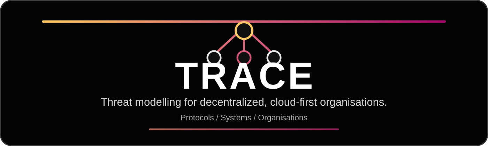

  

# TRACE

TRACE is a threat modelling methodology for Web3 systems, developed at Oak Security and intended to be portable across protocol teams, auditors, researchers, and independent security reviewers.

This repository contains the current working materials for TRACE:

- `METHODOLOGY.md` - methodology specification and workflow
- `article/` - long-form research article draft
- `deck/` - editable PPTX and PDF framework note
- `assets/logo/` - TRACE logo lockups for dark and bright backgrounds
- `assets/header/` - README banner, transparent header illustration candidates, and previews

## Notes

- The logo files are native SVG and have transparent backgrounds unless marked as a preview.
- The README banner is a self-contained SVG designed to render clearly in light and dark GitHub themes.
- Transparent header PNGs are retained as article or presentation illustration candidates. Preview files show how they render on white or dark backgrounds.
- The framework deck is included as both editable PowerPoint and exported PDF.

## License

Except where otherwise noted, the documentation, articles, diagrams, presentation materials, templates, and visual assets in this repository are licensed under the Creative Commons Attribution 4.0 International License (CC BY 4.0).

Suggested attribution:

> TRACE threat modeling methodology, developed by Oak Security, licensed under CC BY 4.0.

The license allows reuse and adaptation with attribution, but it does not grant trademark rights or permission to imply Oak Security endorsement. See `LICENSE.md` and `TRADEMARKS.md`.

This repository currently contains methodology documentation and collateral, not software. If software is added later, it should carry its own software license.
